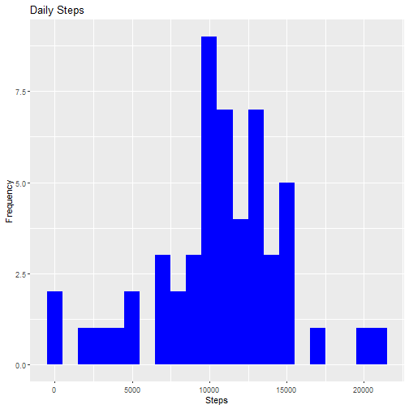
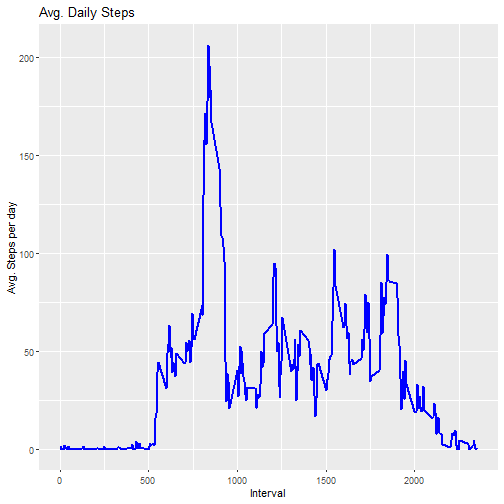
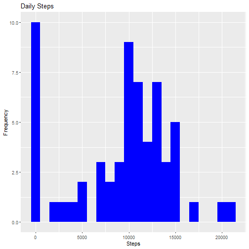
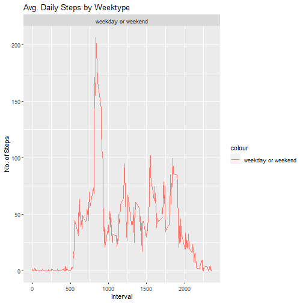

## Loading and preprocessing into data table

```r
library("data.table")
library(ggplot2)
fileUrl <- "https://d396qusza40orc.cloudfront.net/repdata%2Fdata%2Factivity.zip"
download.file(fileUrl, destfile = paste0(getwd(), '/repdata%2Fdata%2Factivity.zip'), method = "curl")
unzip("repdata%2Fdata%2Factivity.zip",exdir = "data")

activityDT <- data.table::fread(input = "data/activity.csv")
```


## What is mean total number of steps taken per day?

```r
Total_Steps <- activityDT[, c(lapply(.SD, sum, na.rm = FALSE)), .SDcols = c("steps"), by = .(date)] 
head(Total_Steps, 10)
```

```
##           date steps
##  1: 2012-10-01    NA
##  2: 2012-10-02   126
##  3: 2012-10-03 11352
##  4: 2012-10-04 12116
##  5: 2012-10-05 13294
##  6: 2012-10-06 15420
##  7: 2012-10-07 11015
##  8: 2012-10-08    NA
##  9: 2012-10-09 12811
## 10: 2012-10-10  9900
```

```r
ggplot(Total_Steps, aes(x = steps)) +
    geom_histogram(fill = "blue", binwidth = 1000) +
    labs(title = "Daily Steps", x = "Steps", y = "Frequency")
```

```
## Warning: Removed 8 rows containing non-finite values (stat_bin).
```



```r
Total_Steps[, .(Mean_Steps = mean(steps, na.rm = TRUE), Median_Steps = median(steps, na.rm = TRUE))]
```

```
##    Mean_Steps Median_Steps
## 1:   10766.19        10765
```


## What is the average daily activity pattern?

```r
## Item 1
IntervalDT <- activityDT[, c(lapply(.SD, mean, na.rm = TRUE)), .SDcols = c("steps"), by = .(interval)] 
ggplot(IntervalDT, aes(x = interval , y = steps)) + geom_line(color="blue", size=1) + labs(title = "Avg. Daily Steps", x = "Interval", y = "Avg. Steps per day")
```




```r
## Item 2
IntervalDT[steps == max(steps), .(max_interval = interval)]
```

```
##    max_interval
## 1:          835
```


## Imputing missing values

```r
## Item 1
activityDT[is.na(steps), .N ]
```

```
## [1] 2304
```


```r
## Item 2
activityDT[is.na(steps), "steps"] <- activityDT[, c(lapply(.SD, median, na.rm = TRUE)), .SDcols = c("steps")]
```


```r
## Item 3
data.table::fwrite(x = activityDT, file = "data/tidyData.csv", quote = FALSE)
```


```r
## Item 4
Total_Steps <- activityDT[, c(lapply(.SD, sum)), .SDcols = c("steps"), by = .(date)] 

Total_Steps[, .(Mean_Steps = mean(steps), Median_Steps = median(steps))]
```

```
##    Mean_Steps Median_Steps
## 1:    9354.23        10395
```

```r
ggplot(Total_Steps, aes(x = steps)) + geom_histogram(fill = "blue", binwidth = 1000) + labs(title = "Daily Steps", x = "Steps", y = "Frequency")
```




## Are there differences in activity patterns between weekdays and weekends?


```r
## Item 1:
activityDT <- data.table::fread(input = "data/activity.csv")
activityDT[, date := as.POSIXct(date, format = "%Y-%m-%d")]
activityDT[, 'Day of Week':= weekdays(x = date)]
activityDT[grepl(pattern = "Monday|Tuesday|Wednesday|Thursday|Friday", x = `Day of Week`), "weekday or weekend"] <- "weekday"
activityDT[grepl(pattern = "Saturday|Sunday", x = 'Day of Week'), "weekday or weekend"] <- "weekend"
activityDT[, 'weekday or weekend' := as.factor('weekday or weekend')]
head(activityDT, 10)
```

```
##     steps       date interval   Day of Week weekday or weekend
##  1:    NA 2012-10-01        0 segunda-feira weekday or weekend
##  2:    NA 2012-10-01        5 segunda-feira weekday or weekend
##  3:    NA 2012-10-01       10 segunda-feira weekday or weekend
##  4:    NA 2012-10-01       15 segunda-feira weekday or weekend
##  5:    NA 2012-10-01       20 segunda-feira weekday or weekend
##  6:    NA 2012-10-01       25 segunda-feira weekday or weekend
##  7:    NA 2012-10-01       30 segunda-feira weekday or weekend
##  8:    NA 2012-10-01       35 segunda-feira weekday or weekend
##  9:    NA 2012-10-01       40 segunda-feira weekday or weekend
## 10:    NA 2012-10-01       45 segunda-feira weekday or weekend
```


```r
## Item 2:
activityDT[is.na(steps), "steps"] <- activityDT[, c(lapply(.SD, median, na.rm = TRUE)), .SDcols = c("steps")]
IntervalDT <- activityDT[, c(lapply(.SD, mean, na.rm = TRUE)), .SDcols = c("steps"), by = .(interval, 'weekday or weekend')] 
```

```
## Error in `[.data.table`(activityDT, , c(lapply(.SD, mean, na.rm = TRUE)), : The items in the 'by' or 'keyby' list are length (17568,1). Each must be length 17568; the same length as there are rows in x (after subsetting if i is provided).
```

```r
ggplot(IntervalDT , aes(x = interval , y = steps, colour='weekday or weekend')) + geom_line() + labs(title = "Avg. Daily Steps by Weektype", x = "Interval", y = "No. of Steps") + facet_wrap(~'weekday or weekend' , ncol = 1, nrow=2)
```


